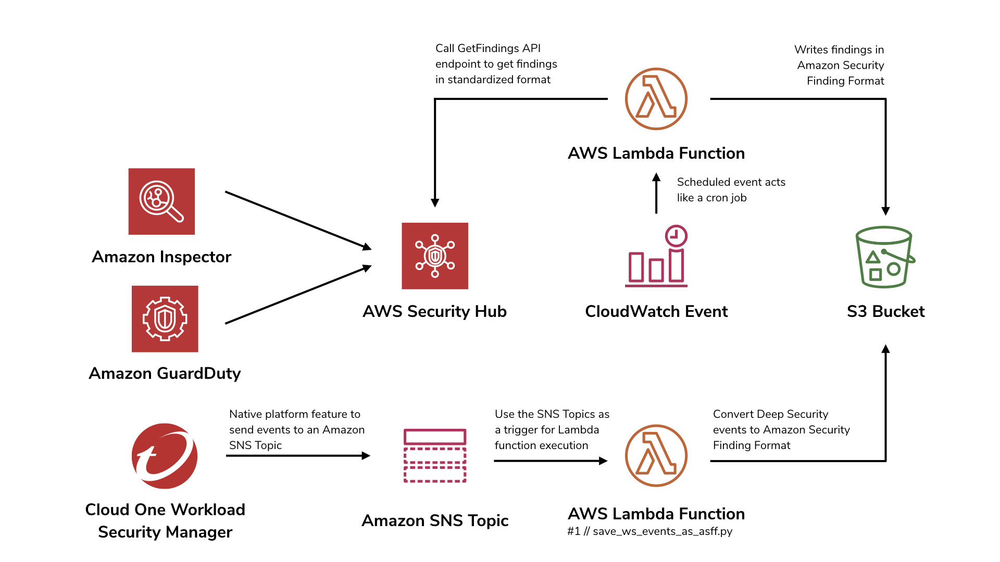

# Cloud One To ASFF

By default, Trend Micro's Cloud One Workload Security sends events to Amazon SNS using a custom JSON format. This simple script converts that JSON document into one compatible with the [Amazon Security Finding Format](https://docs.aws.amazon.com/securityhub/latest/userguide/securityhub-findings-format.html) (ASFF) for **security** events only.

System events from Workload Security don't fit into the format as it was designed for security events and not maintenance or operational events.

## Architecture



AWS Lambda function #1 ([save_ws_events_as_asff.py](save_ws_events_as_asff.py)) is triggered whenever Cloud One Workload Security sends and event to the specific Amazon SNS Topic.

This function then reads the event in Cloud One's format and—for security events only—converts it to Amazon's Security Finding Format.

## Setup

After [configuring the SNS Topic](https://help.deepsecurity.trendmicro.com/sns.html?Highlight=sns) for the Cloud One Workload Security platform, an AWS Lambda function needs to be configured to use the topic as a trigger.

That function runs the [save_ws_events_as_asff.py](save_ws_events_as_asff.py) code and requires one environment variable: **S3_BUCKET_NAME**.

This is the name of the S3 bucket that the ASFF log files will be stored in.

You can also specify an environment variable **REGION** using an AWS region code (e.g., us-east-1). This will connect to the bucket in that region.

The handler for the function should be set to `save_ws_events_as_asff.lambda_handler`.

## Permissions

The AWS Lambda function requires an execution role with the following permissions:

```
logs:CreateLogGroup
logs:CreateLogStream
logs:PutLogEvents
s3:PutObject # should be restricted to the specified bucket
```

This allows the function to write to CloudWatch Logs (handy for debugging and monitoring) and to write the actual log file to the specified Amazon S3 bucket.